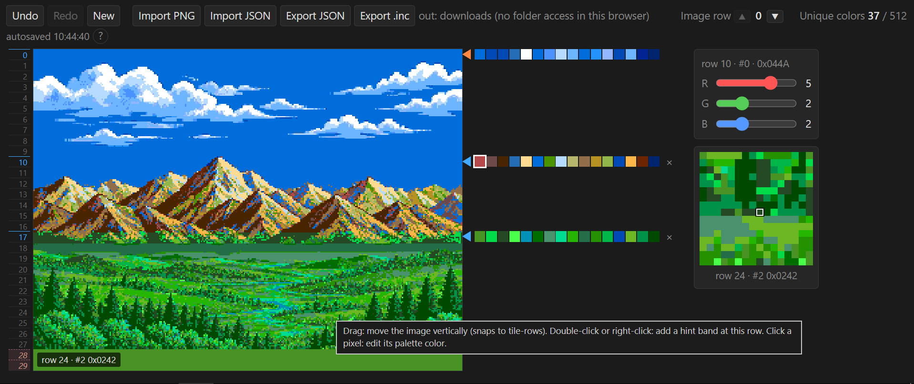

# Copper Bar Tool

A browser-based design tool for Amiga-style "copper bar" effects on the
Sega Mega Drive / Genesis, built around progressive CRAM rewrites during
the horizontal interrupt (H-INT).

No build step, no dependencies: open `index.html` in a browser and go.

## What it does

The Mega Drive VDP has no per-scanline palette. This tool designs the
next best thing: a plan for rewriting all 16 CRAM entries at chosen
scanlines (aligned to 8-line tile-rows), so different vertical bands of
the screen use different palettes. It also simulates, scanline by
scanline, how the 2-colors-per-write hardware reload actually looks
while it's in progress, instead of a simple crossfade.

Import an indexed PNG (≤16 colors), place band markers, edit each
band's 16-color palette (three 3-bit R/G/B sliders per the VDP's
`0x0BGR` / `0x0EEE` color format), and export:

- **`bands.json`** — the design itself (bands, positions, colors), to
  save, share, or reopen later.
- **`copperbands.inc`** — GAS assembler data (band table + color data),
  meant to be pulled into a generic H-INT routine with `#include`.

## Using the export in your game

See `examples/test_asm_copper_tool.s` for a full, working H-INT
routine (SGDK, GNU AS, M68000) that consumes `copperbands.inc`. Drop
the exported `copperbands.inc` next to that file (or your own routine
built the same way) and assemble.

`examples/` also has a sample `bands.json` and the indexed PNG used to
produce it — import both into the tool to reproduce the example, or
use them as a reference for the expected color/PNG format.

## Design notes

The H-INT routine this tool targets is hand-tuned for cycle budget:
the CRAM write is the very first instruction on entry, with no branch
or address computation beforehand, and a one-shot handler prefetches
the next band's data during an idle line so the "continue" path never
changes. See the comments in `examples/test_asm_copper_tool.s` for the
full reasoning.

## License

MIT — see `LICENSE`.
